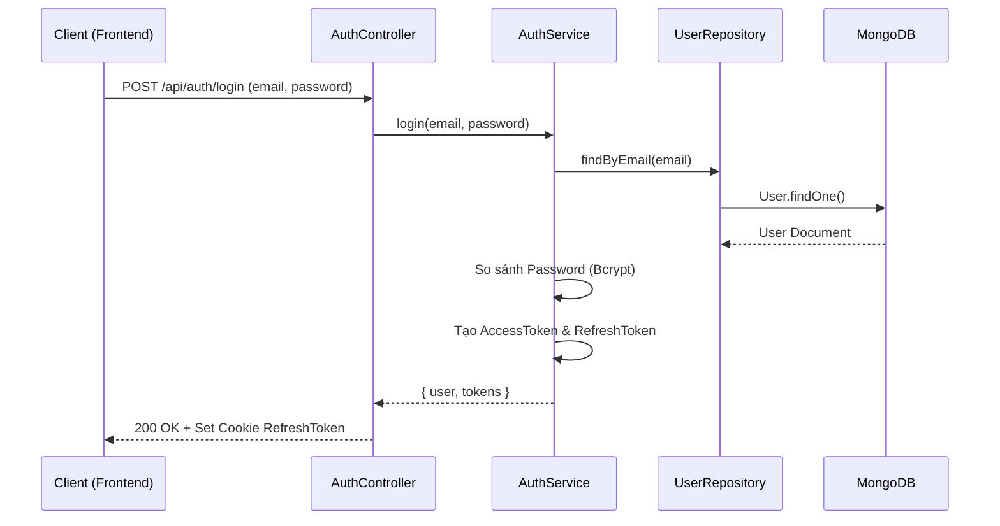
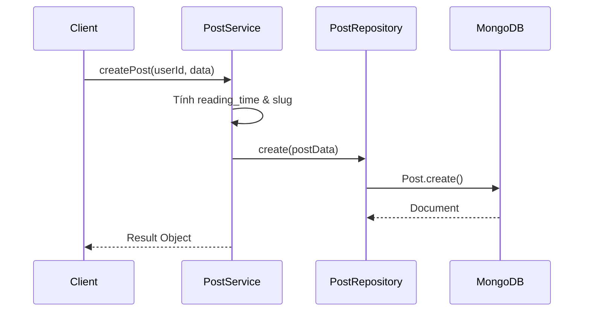
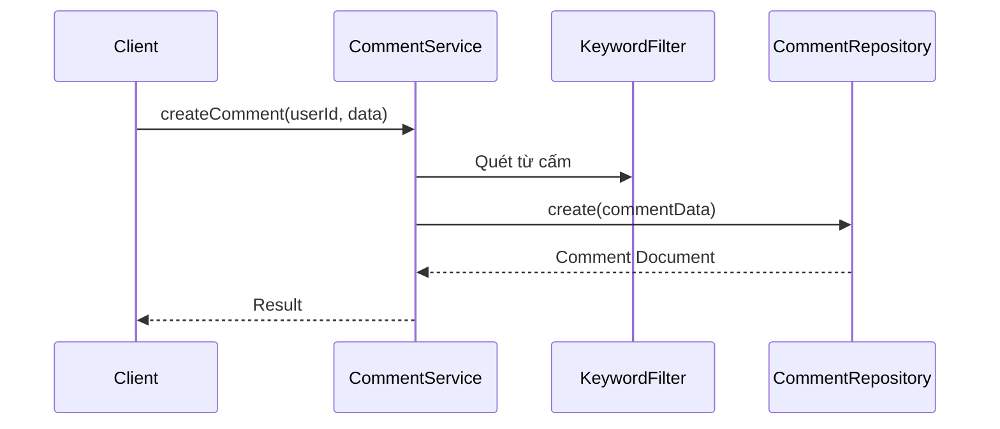
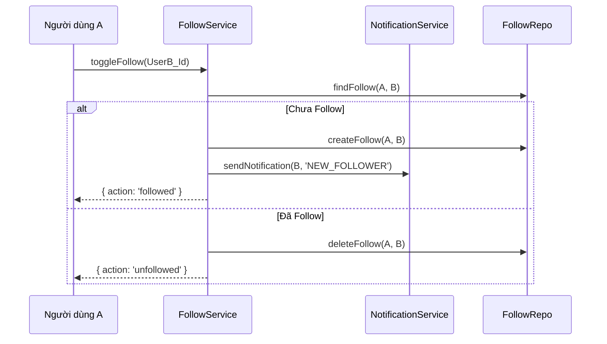
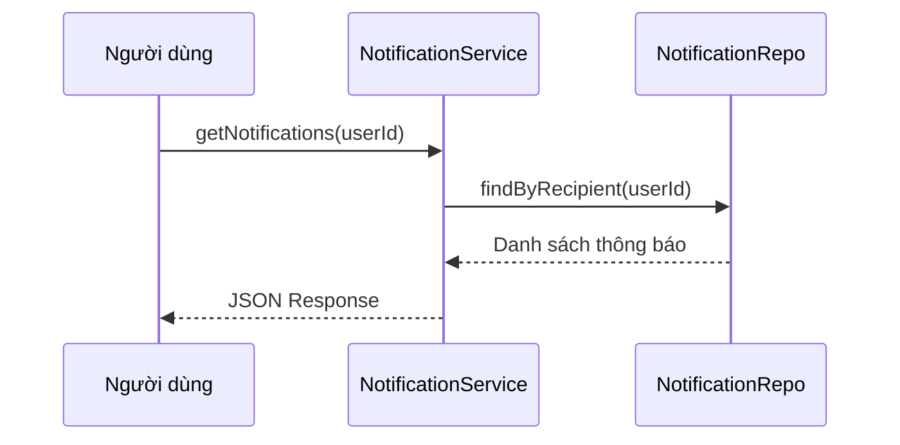
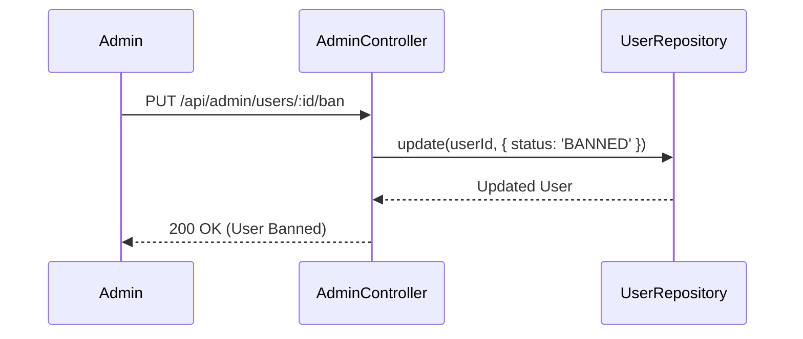
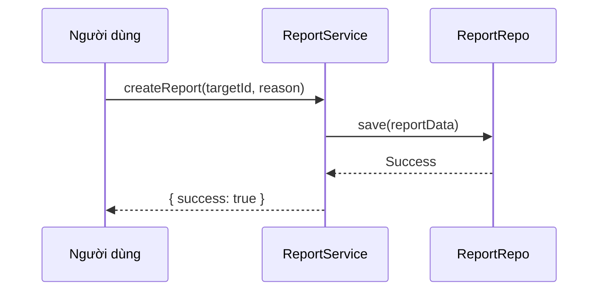

# Technical Design: Hệ Thống Luồng Hoạt Động & API Chi Tiết

---

## 1. Module: Xác Thực (Register & Login)

### 1.1. Sơ đồ luồng Đăng nhập

### 1.2. Chi tiết API

- **Endpoint**: `POST /api/auth/login`
- **Request**: `{ "email": "...", "password": "..." }`
- **Response**: `{ "success": true, "data": { "user": {...}, "accessToken": "..." } }`

---

## 2. Module: Bài Viết (Post Management)

### 2.1. Sơ đồ luồng Đăng bài

### 2.2. Chi tiết API

- **Endpoint**: `POST /api/posts`
- **Request**: `{ "title": "...", "content_html": "...", "content_json": {...} }`
- **Response**: `{ "success": true, "data": { "slug": "...", "reading_time": 5 } }`

---

## 3. Module: Bình Luận (Nested Comments)

### 3.1. Sơ đồ luồng Gửi Bình luận

### 3.2. Chi tiết API

- **Endpoint**: `POST /api/comments`
- **Request**: `{ "post_id": "...", "content": "...", "parent_id": "..." }`
- **Response**: `{ "success": true, "data": { "is_hidden": false } }`

---

## 4. Module: Theo Dõi (Follow System)

### 4.1. Sơ đồ luồng Theo dõi

### 4.2. Chi tiết API

- **Endpoint**: `POST /api/follows`
- **Request**: `{ "following_id": "..." }`
- **Response**: `{ "success": true, "data": { "action": "followed" } }`

---

## 5. Module: Thông Báo (Notification)

### 5.1. Sơ đồ luồng Nhận thông báo

### 5.2. Chi tiết API

- **Endpoint**: `GET /api/notifications`
- **Response**: `{ "success": true, "data": [ { "type": "LIKE", "is_read": false, ... } ] }`

---

## 6. Module: Quản Trị (Admin Control)

### 6.1. Sơ đồ luồng Khóa tài khoản (Ban User)

### 6.2. Chi tiết API

- **Endpoint**: `PUT /api/admin/users/:id/ban` (Yêu cầu quyền ADMIN)
- **Response**: `{ "success": true, "message": "User banned" }`

---

## 7. Module: Báo Cáo (Reporting)

### 7.1. Sơ đồ luồng Gửi Báo cáo

### 7.2. Chi tiết API

- **Endpoint**: `POST /api/reports`
- **Request**: `{ "target_id": "...", "target_model": "Post", "reason": "Spam" }`
- **Response**: `{ "success": true, "message": "Report submitted" }`

---

## 8. Tóm tắt Cấu Trúc Dự Án

- **Controllers**: Quản lý các yêu cầu HTTP.
- **Services**: Nơi thực hiện 100% logic nghiệp vụ.
- **Repositories**: Nơi tương tác trực tiếp với Database.
- **Models**: Định nghĩa cấu trúc dữ liệu Mongoose.
